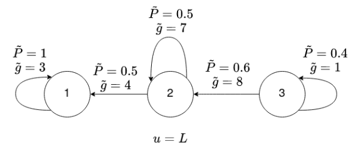
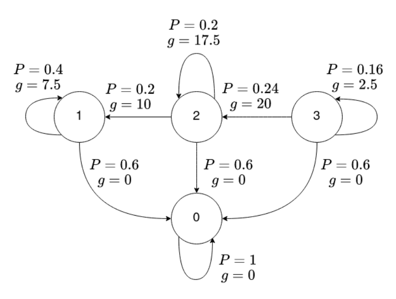
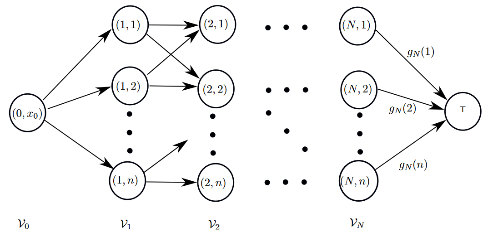

# Dynamic Programming and Optimal Control

---

by : walkerchi

---


## Mathematics

**Notation**

- $x$ : state, $x\in\mathcal S = \mathcal S^+\cup\{0\}$, 

  - $x_0$ or $x(0)$ : initial state for discrete / continuous situation

  - there are $N_x$​ distinct states for each time step
  
  - $\tilde x$ tend to represent extend states like $\tilde x_k = \begin{bmatrix}x_k,y_k\end{bmatrix}^\top$
- $w(t)$ : disturbance
- $u(t)$ : control input , $u\in\mathcal U$, there are $N_u$ distinct control inputs for each time step
- $\mu(t,x)$ : admissible control law (policy), $u(t)\sim \mu(t,x)$

  - $\pi$ : policy, $\pi^*$ optimal policy
- $f(x,u)$ : system evolution 

  - for continuous system: $\dot x(\tau)=f(x(\tau),u(\tau))$
  - for discrete system : $x_{k+1}= f_k(x_k,u_k,w_k)$
- $g_k(x,u)$ : cost for each step ,
  -  $g_N(x)$ is the cost for discrete terminal state
  - $h(x)$ is the cost for continuous terminal state

- $J(t,x)$ : cost function, $J^*$ optimal policy
- $N$ : time horizon
- $P_{ij}$ : probability of transition from state $i$ to state $j$, $\text{Pr}(x_{k+1}=j|x_k=i,u_k=\mu(i)) = P_{ij}(\mu(i))$
- $q(i,u)$ : expectation of cost $q(i,u)=\underset{w|x=i,u=\text u}{\mathbb E}[g(x,u,w)]$
- $p(t)$​ : trajectory

**Probability** 

- $x\sim\mathcal N(\mu,\sigma^2)$ then $x^2\sim\mathcal N(\mu^2+\sigma^2, 2\sigma^4+4\mu^2\sigma^2)$​
- $x\sim \mathcal N(\mu, \sigma^2)$ then $Cx  \sim \mathcal N(C\mu, C^2\sigma^2)$

**Quadratic**

$f(x) = ax^2+bx+c$

- $f'(x)=0\to x = -\frac{b}{2a}$​​  
- $f(x)|_{f'(x)=0} = -\frac{b^2}{4a}+c$

**Laplace Transform**

| time domain | $s$ domain                  |
| ----------- | --------------------------- |
| $1$         | $\frac{1}{s}$               |
| $e^{at}$    | $\frac{1}{s-a}$             |
| $\dot  f$   | $sF - f(0)$                 |
| $e^{at}f$   | $F(s-a)$                    |
| $f(at)$     | $\frac{1}{a}F(\frac{s}{a})$ |
| $af+bg$     | $aF+bG$                     |


## Problem Statement

**Dynamics**
$$
x_{k+1} = f_k(x_k,u_k,w_k)\\
\dot x = f(x,u,w)
$$
**Cost** 
$$
J_\pi = \mathbb E\left[g_N + \sum_{k=0}^{N-1}g_k(x_k,u_k,w_k)\right]
$$

- $J^*_\pi$ : optimal cost $J_\pi^* =  \text{max}~J_\pi$

**Open Loop** : control inputs are determined at beginning

- expected cost 

$$
J(\text x) = \underset{(X_1,W_0|x_0=\text x)}{\mathbb E}\left[g_N(x_N) + \sum_{k=0}^{N-1}g_k(x_k,\bar u_k,w_k)\right]
$$

- *Number of Open Loop Strategies* : $N_u^N$​ all the possible path from start to end

  

**Closed Loop** : $u(t)\to \mu(t,x)$  control inputs depend on the measured state 

- expected cost

$$
J_\pi (\text x) = \underset{(X_1,W_0|x_0=\text x)}{\mathbb E}\left[g_N(x_N) +\sum_{k=0}^{N-1}g_k(x_k,\mu_k(x_k),w_k)\right]
$$

- *Number of Close Loop Strategies* : $N_u(N_u^{N_x})^{N-1}$ (number of state stay constant) or $N_u^{\sum_k N_x^k}$ all possible path for unique set of all reachable states $\sum_k N_x^k$​

  

**Open Loop vs Closed Loop** 

- open loop is special case of closed loop
- open never performs better  than closed loop
- for deterministic problem , closed loop is not  efficient as open loop


## [DPA]Dynamic Programming Algorithm

$$
J_k(\text x) = \underset{\text u\in\mathcal U(\text x)}{\text{min}} \underset{(w_k|x_k=\text x, u_k=\text u)}{\mathbb E}\left[g_k(x_k,u_k,w_k)+J_{k+1}(f(x_k,u_k,w_k))\right]\quad J_N(\text x) = g_N(\text x)
$$

- *Number of Minimizations* : number of reachable states $\sum_k  N_x^k$
- when there is no disturbance $w_k$​, it can be solved by forward DPA

**general state** : 

Example : $x_{k+1} = f_k(x_k,x_{k-1},u_k,u_{k-1},w_k)$, $\tilde x_{k+1} = \begin{pmatrix}x_{k+1}\\y_{k+1}\\s_{k+1} \end{pmatrix}=\begin{pmatrix}f_k(x_k,y_k,u_k,s_k,w_k)\\y_k\\u_k\end{pmatrix}$ where $y_k = x_{k-1}$, $s_k = u_{k-1}$ 

**Infinite Horizon Problems** : $N\to \infin$ and time invariant cost $g_k\to g$

- Recursion
  $$
  J_k(\text x) = \underset{\text u\in\mathcal U(\text x)}{\text{min}} \underset{(w|x=\text x, u=\text u)}{\mathbb E}\left[g(x,u,w)+J_{k+1}(f(x,u,w))\right]\quad J_N(\text x) = g_N(\text x)
  $$

- $N\to\infin$ it becomes  BE, if $J_N$ converge, then  $J(x)=J^*(x)$


## [BE]Bellman Equation

$$
J^*(x) = \underset{u\in\mathcal U(x)}{\text{min}}\underset{(w|x=\text x,u=\text  u)}{\mathbb E}[g(x,u,w)+J^*(f(x,u,w))]
$$
$$
V^*(x) = \underset{u\in \mathcal U}{\text{min/max}}\left[r(x,u) + \alpha\sum_{x'} P_{x,x'}(u)V*(x')\right]
$$

- convergence of IHP

**[SSP]Stochastic Shortest Path** : the transition from state $i$ to state $j$ is governed by $\text{Pr}(w_{k+1}=j|x_k=i,u_k=\text u)=P_{ij}$
$$
J_k(i) = \underset{\text u\in \mathcal U(i)}{\text{min}}\left(q(i,u) + \sum_{j=0}^n P_{ij}(u)J_{k+1}(j)\right)
$$
- $P_{ij}$ is time-invariant, $P_{ij}\ge0$
- cost-free terminal state $P_{00}(\text u)=1$ and $g(0,\text u,0)=0$ $\forall \text u\in \mathcal U(0)$​
- In the terminal state, any admissible control action is optimal

**[VI] Value Iteration**
$$
V_{l+1}(i) = \underset{\text u\in \mathcal U(i)}{\text{min}}\left(q(i,u)  + \alpha\sum_{j=1}^n P_{ij}(\text u)V_l(j)\right)
$$

- *infinite* number of iteration to converge to optimum $J^*$,  when to stop : threshold for $\Vert V_{l+1}(i) - V_l(i)\Vert$

- complexity : $\mathcal O(n^2p)$, $n$ is  the number of states,  $p$ is the possible control inputs

- synchronous update
  $$
  V_{l+1}(i) = \underset{\text u\in \mathcal U(i)}{\text{min}}\left(q(i,u)  + \alpha\sum_{j=1}^n P_{ij}(\text u)V_l(j)\right)
  $$
  
  
  ```python
  for i in range(n):
      V_[i] = (q[i] + P[i] @ V).max(axis=u_axis)
  V[:] = V_
  ```
  
- *Gauss-Seidel Update* asynchronous update
  $$
  V_{l}(i) = \underset{\text u\in \mathcal U(i)}{\text{min}}\left(q(i,u)  + \alpha\sum_{j=1}^n P_{ij}(\text u)V_l(j)\right)
  $$
  
  
  ```python
  for i in range(n):
      V[i] = (q[i] + P[i] @ V).max(axis=u_axis)
  ```


**[PI] Policy Iteration**

- Value Update:
  $$
  V_{l+1}(i) = q(i,u)  + \alpha\sum_{j=1}^n P_{ij}(\text u)V_l(j)
  $$

  - complexity : $\mathcal O(n^3)$, $n$ is the number of states, solve linear system

- Policy Improvement:
  $$
  \mu^{l+1}(i) = \underset{\text u\in \mathcal U(i)}{\text{argmin}}\left(q(i,u) + \alpha \sum_{j=1}^n P_{ij}(u) V_{l+1}(j)\right)
  $$

  - complexity : $\mathcal O(n^2p)$, $n$ is the number of states, $p$ is the possible control inputs
  
- *cost-free terminal state* and *proper policy* ($J_\pi(i)\neq\infin$, every state could  reach $0$), PI converges to optimum after a *finite* number of steps

- *Asynchronous  PI* 

  - any  number of value updates in between policy updates
  - any number of states updated at each value update
  - any number of states  updated at each policy update

- converge to the same optimal cost as *VI* if the solution is unique

- has unique solution $\Leftrightarrow$ $I-P$  invertible $\Leftrightarrow$ remove terminal state $0$ $S\to S^+$​

- discounted problem can arbitrary initialized

- discounted problem $I-\alpha P$ always  invertible

- values of each state  at each iteration should decrease of remain  the same.

**[LP]Linear Programming** : used to solve the BE and yields optimal  cost $J^*$ for SSP
$$
\underset{V}{\text{max}}\sum_{i\in \mathcal  S^+} V(i)
\\
\text{subject to}~V(i)\le\left(q(i,\text u) + \alpha \sum_{j=1}^nP_{ij}(\text u)V(j)\right)~\forall \text u \in \mathcal U(i),\forall i\in \mathcal S^+
$$
- to transform to form $\begin{aligned}&\text{min}~\textbf f^\top\textbf x\\ &\text{sub}~\textbf A\textbf  x\le \textbf b\end{aligned}$
  - $\textbf A = -\begin{bmatrix}\mathbb I - \alpha P_{u_1}\\ \vdots \\\mathbb I - \alpha P_{u_{N_u}}\end{bmatrix}$ where $P_{u_i} =\begin{bmatrix}P_{11}(u_i)&\cdots&P_{1N_x}(u_i)\\\vdots &\ddots & \vdots\\P_{N_x1}(u_i)&\cdots&P_{N_xN_x}(u_i)\end{bmatrix}$
  - $\textbf b = -\begin{bmatrix}\textbf b_{u_1}\\\vdots\\\textbf  b_{u_{N_u}}\end{bmatrix}$ where $\textbf b_{u_{N_i}}=\begin{bmatrix}r(1,u_i)\\\vdots\\r(N_x,u_i)\end{bmatrix}$​
  - minimize problem $\textbf f = -\textbf  1$, maximize problem $\textbf f=1$

**Discounted Problem** : decay exponentially
$$
\tilde J_{\tilde \pi}(i) = \underset{(\tilde X_1,\tilde W_0|\tilde x_0=i)}{\mathbb E}\left[\sum_{k=0}^{N-1}\alpha^k\tilde g(\tilde x_k,\tilde u_k,\tilde w_k)\right]
$$
- finite steps
- arbitrary initial

**Auxiliary Stochastic Shortest Path** : equivalent Discounted Problem

*Dynamics*  : 
$$
\begin{aligned}
p_{w|x,u}(j|i,u) &= \alpha  \tilde P_{ij}(u)
\\
p_{w|x,u}(0|i,u) &= 1-\alpha
\\
p_{w|x,u}(j|0,u) &= 1
\\ 
p_{w|x,u}(0|0,u) &= 1
\end{aligned}
$$

*Cost* :  

$g(x_k,u_k,w_k) = \alpha^{-1}\tilde g(x_k,u_k,w_k)$

- one to one mapping to discounted problem

- Example : given discount factor $\alpha=0.4$

   

  


## [SP]Shortest Path Problem

**[DFS] Deterministic Finite State Problem** : 
$$
x_{k+1} = f_k(x_k,u_k)\\
J=g_N(x_N) + \sum_{k=0}^{N-1}g_k(x_k,u_k)
$$
**[SP] Shortest Path** : in a graph, find a path from node $s\in \mathcal V$ to $t\in \mathcal V$ that has a smallest length
$$
Q^* = \underset{Q\in\mathbb Q_{s,t}}{\text{argmin}} = \underset{Q\in\mathbb Q_{s,t}}{\text{argmin}}\sum_{h=1}^{q-1}c_{i_h,i_{h+1}}
$$
- *symmetric* : forward DPA and backward DPA are the same for this problem

- *no negative cycles* : $\forall i\in\mathcal V, Q\in \mathcal Q_{i,i},J_Q\ge 0$ , if negative, there will exist infinite loop​

- $N\le|\mathcal V|-1$

- DFS to SP 

  

  

- why it can be solved by forward  DPA ($J_k\gets J_{k+1}$)? it's deterministic
- why it can be solved by backward DPA ($J_k\gets J_{k-1}$)? it  can be  converted to a deterministic DP problem.

**[HMM]Hidden Markov Model** : 

- measurement model : $z$ is measure in transition from $i$ to $j$

$$
M_{ij}(z) = p_{z|x,w}(z|i,j)
$$


**Viterbi Algorithm** : Given measured sequence $Z_1=(z_1,\cdots,z_N)$, we want to find the most likely state trajectory  $X_0=(x_0,\cdots,x_N)$
$$
\begin{aligned}
&\underset{X_0}{\text{max}}~p(X_0, Z_1) = p(x_0)\prod_{k=1}^N P_{x_{k-1}x_k}M_{x_{k-1}x_k}(z_k)
\\
\Leftrightarrow &\underset{X_0}{\text{min}}\left(c_{s,(0,x_0)}+\sum_{k=1}^Nc_{(k-1,x_{k-1}),(k,x_k)}\right)
\end{aligned}
$$
where 
$$
\begin{aligned}
c_{s,(0,x_0)} &= \begin{cases}
-\text{ln}(p(x_0))&p(x_0)>0
\\
\infin & p(x_0) = 0
\end{cases}
\\
c_{(k-1,x_{k-1}),(k,x_k)}&=\begin{cases}
-\text{ln}(P_{x_{k-1}x_k}M_{x_{k-1}x_k}(z_k)) & P_{x_{k-1}x_k}M_{x_{k-1}x_k}(z_k)>0\\
\infin & P_{x_{k-1}x_k}M_{x_{k-1}x_k}(z_k) = 0
\end{cases}
\\
c_{(N-1,x_{N-1})} &= 0
\end{aligned}
$$

- DPA can be applied to already solve for the most likely  state trajectory up until now.
- Future measurements can change the most likely trajectory for pasttime steps

**[LCA]Label Correcting Algorithm** 

1. $s\to \text{OPEN}$, set $d_s=0,d_j=\infin~\forall  j\in \mathcal V/\{s\}$
2. $\text{OPEN}\rightarrow\{i\}\cup\text{OPEN}$
3. $\forall j\in \mathcal N_i$ if $(d_i+c_{ij})<d_j $ and $(d_i+c_{ij})<d_{t}$, $d_j\gets d_i+c_{i,j}$, $j.\text{parent} \gets i$; if $j\neq t$ , $\text{OPEN}\gets\text{OPEN}\cup\{j\}$
4. $|\text{OPEN}| > 0$ goto 2

```python
# step 0, s is the initial seed
open_set = [s]
d = np.fill([n], np.inf)
d[s] = 0 

while len(open_set) > 0:
	# step 1 visit node in open set
    i = open_set.pop()
    for j in i.children:
        # step2 update the distance of j
        # d[i]+c[i,j]+h[j] < dt -> A-star
        # h:positive lower bound get from node j to T
        if d[i]+c[i,j] < d[j] and (d[i]+c[i,j]) <dT:
            d[j] = d[i] + c[i,j]
            j.parent = i
            if not j is T:
                open_set.append(j)
```

- *Search Order* :

  - *Breadth-first* 

  - *Depth-first*

  - *Best-first*: $d_i$ the smallest nearest first
- *Dijkstra's Algorithm* : $d_i$ best-first
- *A*$^\star$ : $d_i+h_i$ best-first, where $h_i=\underset{k\in\mathcal V/\{j\}}{\text{min}}c_{jk}$ 

## [HJB]Hamilton-Jacobian-Bellman Equation

$$
0 = \underset{u\in\mathcal U}{\text{min}}\left(g(\text x,u) + \frac{\partial J^*(t,\text x)}{\partial t} + \frac{\partial J^*(t,\text x)}{\partial \text x}f(\text x,\text u)\right)
$$

where $J^*(T,\text x)=h(x)$ 

**Pontryagin's Minimum Principle** : 
$$
\begin{aligned}
H(\text x, \text u,\text p) &= g(\text x, \text u)+ \text p^\top f(\text x,\text u)
\\
\dot p(t) &= -\left.\frac{\partial H(\text x, \text u, \text p)}{\partial  \text x}\right|^\top_{\begin{matrix}x(t)\\u(t)\\p(t)\end{matrix}}
\\
p(T) &= \left.\frac{\partial h(\text x)}{\partial\text x}\right|^\top_{x(T)}
\\
u(t) &= \underset{\text u\in \mathcal U}{\text{argmin}}H(x(t),\text u,p(t))
\\
\dot x(t) &= f(x(t),u(t))
\end{aligned}
$$
- necessary condition  for optimal cost

- *Bang-Bang Control* : $u\in \{a,b\}$​
  - Example : $\ddot x = u, a<0<b$ , normally $u=\begin{cases}b & t\in[0,t]\\a&t\in[t,T]\end{cases}$

- minimize total time $T$: $g(\text x,\text u) = 1$, since $T=\int_0^T 1\text d\tau$

**optimal trajectory**
$$
H(x(t),u(t),p(t)) = -\left.\frac{\partial J(t,x)}{\partial t}\right|_{x(t)} = \text{constant}
$$


